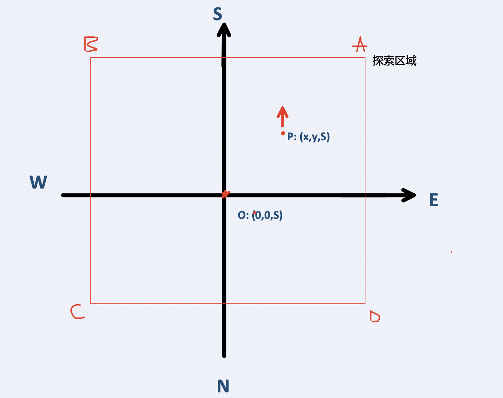
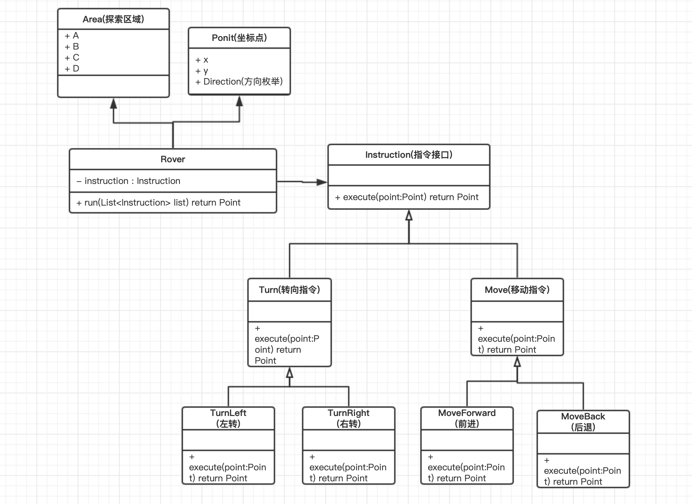

## 

## 项目介绍
   假想你在火星探索团队中负责软件开发。现在你要给登陆火星的探索小车编写控制程序，根据地球发送的控制指令来控制火星车的行动。
   
## 初始需求
   
   火星车收到的指令分为四类：
   
   * 探索区域信息：告知火星车，整片区域的长度（X）和宽度（Y）有多大；
   * 初始化信息：火星车的降落地点（x, y）和朝向（N, S, E, W）信息；
   * 移动指令：火星车可以前进（f）或后退（b）；
   * 转向指令：火星车可以左转90度（l）或右转90度（r）。
   
   由于地球和火星之间的距离很远，指令必须批量发送，火星车执行完整批指令之后，再回报自己所在的位置坐标和朝向。
   

## 扩展需求
   下面是火星探索团队提出的其他一些需求：
   
   * 应该阻止小车跑到超出整片区域坐标系的地方去
   * 火星不是平的，而是球体，所以如果小车从坐标系的一边跑了出去，应该从另一边跑进来
   * 火星地面上有障碍物，如果火星车遇到了障碍物导致后续指令受阻，应该停留在原地，放弃执行后续指令，并立即向地球回报
   
   你需要自己判断，是否采纳这些需求。
   
## 任务1: Mars Rover 初体验

做题要求：

  1. 看懂题目，开始编码之前先花10分钟拆解任务，把任务清单写下来

  2. 计时，开始编码

  3. 要求用TDD的方式实现：先写测试，后写代码
  
  
### 第一步: 拆解任务,设计代码结构

> 注: 以下都是基于我本人对需求的理解,如有不同,欢迎建议, 莫杠 !

只考虑探索二维区域,则探索示意图如下:

分析需求可知,我们的系统应该有以下几种模型: 

* Area: 探索区域,应该由 四个顶点组成的 二维平面坐标系 (A,B,C,D),为了简单,我们假设 Area 为规则的 长方形区域
* Rover: 火星车, 有区域限制(Area)和初始坐标(Point), 并且可以接受一系列指令(Instruction)
* Instruction: 指令接口
* Turn: 转向指令抽象类
* Move: 移动指令抽象类(移动指令会出现越界的可能)

### 第二步: tdd 节奏编码

根据这几次项目的体会,我个人觉得 tdd 最好的开发节奏是这样的:

* 1.分析需求: 弄懂需求,拆解任务
* 2.建模: 就是在脑海中建立一个大概的系统模型图,比如 Mars Rover ,我通过分析需求,抽象出了 Rover ,Instruction 等模型
* 3.分析模型: 行为,边界,职责
* 4.各个击破: 对抽象出的每个模型进行测试开发

